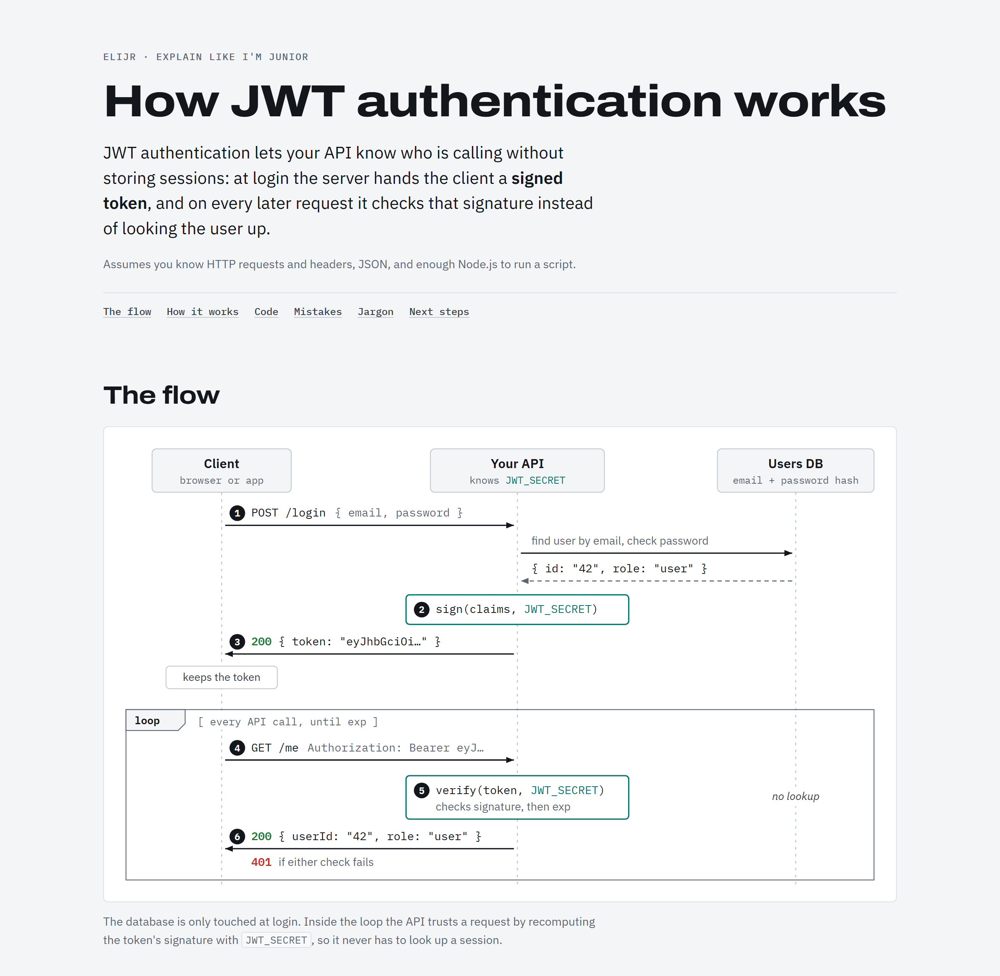

# elijr

Explain Like I'm Junior.

```
/elijr how does JWT authentication work
```

Produces a HTML artifact with a diagram, a minimal code example, common mistakes and key jargon, aimed at someone who knows basic programming but is new to the topic.



*Real output of `/elijr how does JWT authentication work` (top of the page). The full page continues with step-by-step explanation, a minimal code example, common mistakes, jargon and next steps.*

## Install

```
/plugin marketplace add emirhansilsupur/elijr
/plugin install elijr@elijr
```
